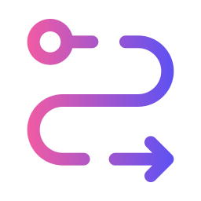

<a id="readme-top"></a>
<br />
<div align="center">
    
  
  

  <h1 align="center">E2E Test Automation Project for LP Express</h3>
  

</div>


<details>
  <summary>Table of Contents</summary>
  <ol>
    <li>
      <a href="#about-the-project">About The Project</a>
      <ul>
        <li><a href="#test-coverage">Test Coverage</a></li>
        <li><a href="#built-with">Built With</a></li>
      </ul>
    </li>
    <li>
      <a href="#getting-started">Getting Started</a>
      <ul>
        <li><a href="#prerequisites">Prerequisites</a></li>
        <li><a href="#installation">Installation</a></li>
      </ul>
    </li>
    <li><a href="#usage--reports">Usage & Reports</a></li>
    <li><a href="#test-documentation">Test Documentation</a></li>
    <li><a href="#project-management-jira">Project Management (Jira)</a></li>
    <li><a href="#roadmap">Roadmap</a></li>
    <li><a href="#contact">Contact</a></li>
    <li><a href="#license">License</a></li>
  </ol>
</details>

<br>

---

## About The Project

This automated End-to-End (E2E) test suite was developed as the final project for my studies.

The project is a set of automated E2E tests built with **Cypress** to verify the core services on the [LP Express](https://lpexpress.lt/) website. The goal was to build reliable, high-quality tests using best practices to ensure critical customer flows are always working correctly.

### What it Shows:

* **Architecture:** Utilizes the **Page Object Model (POM)** to make tests highly readable and maintainable.
* **Reporting:** Generates professional, consolidated **HTML reports** (using Mochawesome) showing pass/fail status and screenshots on failure.
* **CI/CD:** Tests run automatically on every push via **GitHub Actions** for immediate validation of code changes.

### Test Coverage

The solution provides comprehensive coverage across three critical feature areas:

1.  **Parcel Tracking:** Testing for both delivered status (Positive) and clear error messaging (Negative) when tracking parcels.
2.  **Parcel Sending:** Full E2E flow for locker-to-locker price calculation (XS, S, M, L and XL parcels) and order summary validation.
3.  **Locker Map:** Verification of search and filtering functionality (City selection, partial and exact address search).
  
---

### Built With

* [![Node.js][Node-shield]][Node-url]
* [![GitHub-shield]][GitHub-url]
* [![Jira-shield]][Jira-url]
* [![Cypress][Cypress-E2E-Tests-shield]][Cypress-url]
* [![GitHub Actions][CI-with-GitHub-Actions-shield]][CI-with-GitHub-Actions-url]
* [![RIMRAF][RIMRAF-shield]][RIMRAF-url]
* [![Mochawesome][Report-Generation-shield]][Report-Generation-url]

---

## Getting Started

To get a local copy up and running, follow these simple steps.

### Prerequisites

This project requires Node.js and npm (which is usually bundled with Node.js).

* **Node.js (v22.x recommended)**
* **npm**
  
---
### Installation

1. Clone the repo
   ```sh
   git clone https://github.com/nuobodu/lpexpress-e2e-tests.git
   ```
2. Install NPM packages
   ```sh
   npm install
   ```

---

## Usage & Reports

This project includes two main scripts for local execution: one for the Cypress test runner and one for the CI/Report generation flow.

1.  **Open the Cypress Test Runner (UI Mode)**: To run tests interactively and see the application in a browser:
    ```bash
    npm run cy:open
    ```

2.  **Run Tests in Headless Mode (CI Flow)**: To execute all tests in headless mode (like in the CI pipeline) and generate the final report:
    ```bash
    npm run cy:run
    ```
    This command executes all tests and generates the report. The final **HTML report** will be generated at: `cypress/reports/html/index.html`.


---

## Test Documentation

The complete testing strategy, including **all defined scenarios, preconditions, and expected results** for every implemented test case (LEET-7 through LEET-21), is detailed in a separate documentation file.

* **[View the Full Test Plan and Scenarios (testCases.md)](./testCases.md)**

---

## Project Management (Jira)

This project was managed using a **Jira** to demonstrate agile practices, track progress, and organize test development into sprints.

* **[View the Project Board and Task Statuses (jira.md)](./jira.md)**
  
---
## Roadmap

* [x] Initial E2E test scenarios and test cases defined (LEET-7 through LEET-14)
* [x] CI Pipeline setup with GitHub Actions
* [x] Consolidated HTML Reporting (Mochawesome)
* [x] Implement automation of the initial 8 E2E test cases (LEET-7 through LEET-14)
* [x] Create additional E2E test cases for initial scenarios for more coverage
* [x] Implement automation of the additional test cases
* [x] **Refactor Data Management using Cypress Fixtures** (Move all test data: addresses, names, tracking numbers, etc., to `cypress/fixtures`.)

---

## Contact

Mantas Dauparas  
[![LinkedIn-shield]][linkedin-url]

Project Link:  
[![GitHub-Repository-shield]][GitHub-Repository-url]

---

## License

Distributed under the MIT License. See [LICENSE](./LICENSE) for more information.

<p align="right">(<a href="#readme-top">back to top</a>)</p>


<!-- MARKDOWN LINKS & IMAGES -->

[Node-shield]: https://img.shields.io/badge/-Node.js-green?style=for-the-badge&labelColor=grey&logo=node.js&logoColor=green
[Node-url]: https://nodejs.org/en
[Cypress-E2E-Tests-shield]: https://img.shields.io/badge/Cypress-69D3A7.svg?labelColor=grey&style=for-the-badge&logo=cypress&logoColor=69D3A7
[Cypress-url]: https://www.cypress.io/
[CI-with-GitHub-Actions-shield]: https://img.shields.io/badge/GitHub_Actions-2088FF.svg?labelColor=grey&style=for-the-badge&logo=githubactions&logoColor=2088FF
[CI-with-GitHub-Actions-url]: https://docs.github.com/en/actions
[RIMRAF-shield]: https://img.shields.io/badge/RIMRAF-CB3837.svg?labelColor=grey&style=for-the-badge&logo=npm&logoColor=CB3837
[RIMRAF-url]: https://www.npmjs.com/package/rimraf
[Report-Generation-shield]: https://img.shields.io/badge/Mochawesome-CB3837.svg?labelColor=grey&style=for-the-badge&logo=npm&logoColor=CB3837
[Report-Generation-url]: https://www.npmjs.com/package/mochawesome
[GitHub-shield]: https://img.shields.io/badge/GitHub-181717?labelColor=grey&style=for-the-badge&logo=github&logoColor=white
[GitHub-url]: https://github.com/nuobodu/lpexpress-e2e-tests
[Jira-shield]: https://img.shields.io/badge/Jira-0052CC?labelColor=grey&style=for-the-badge&logo=jira&logoColor=0052CC
[Jira-url]: https://www.atlassian.com/software/jira
[GitHub-Repository-shield]: https://img.shields.io/badge/lpexpress--e2e--tests-181717?labelColor=181717&style=for-the-badge&logo=github&logoColor=white
[GitHub-Repository-url]: https://github.com/nuobodu/lpexpress-e2e-tests
[LinkedIn-shield]: https://img.shields.io/badge/linkedIn-0077B5?style=for-the-badge
[linkedin-url]: https://www.linkedin.com/in/dauparas-mantas/